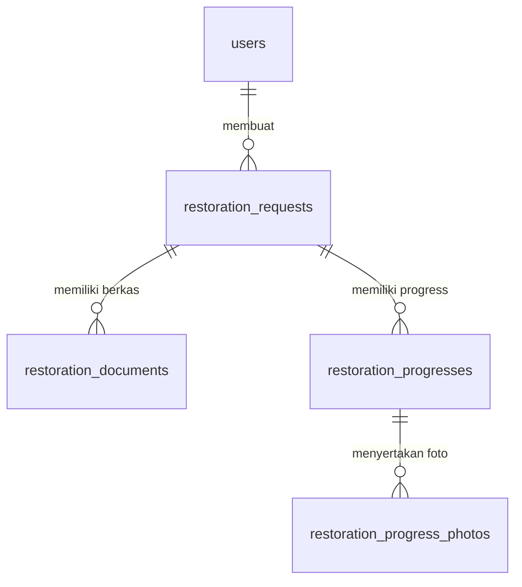
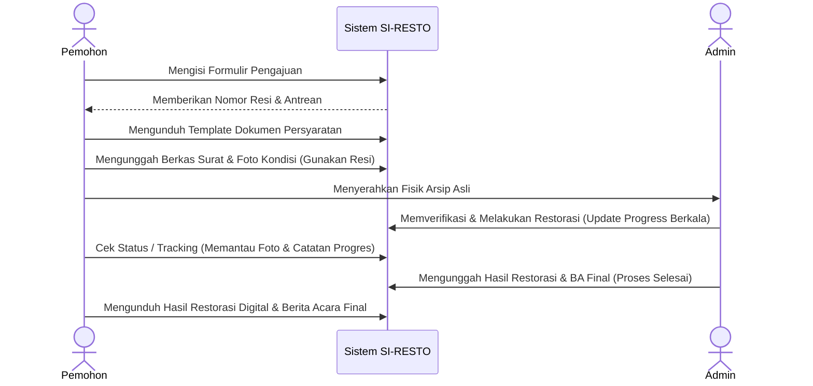

# Buku Panduan (Manual Book) - SI-RESTO
**Sistem Informasi Restorasi Arsip Online**

Buku panduan ini disusun untuk memberikan dokumentasi teknis dan operasional secara lengkap mengenai sistem **SI-RESTO**. Dokumentasi ini mencakup arsitektur sistem, petunjuk instalasi, struktur kode, skema basis data, alur kerja (workflow), serta panduan penggunaan antarmuka baik untuk pemohon umum maupun administrator.

---

## Daftar Isi
1. [Pendahuluan & Gambaran Umum](#1-pendahuluan--gambaran-umum)
2. [Arsitektur & Stack Teknologi](#2-arsitektur--stack-teknologi)
3. [Panduan Instalasi & Konfigurasi](#3-panduan-instalasi--konfigurasi)
4. [Struktur Direktori Proyek](#4-struktur-direktori-proyek)
5. [Skema Database & Relasi](#5-skema-database--relasi)
6. [Alur Kerja Sistem (Workflow)](#6-alur-kerja-sistem-workflow)
7. [Panduan Penggunaan Antarmuka (UI Guide)](#7-panduan-penggunaan-antarmuka-ui-guide)
8. [Panduan Pengembang & Troubleshooting](#8-panduan-pengembang--troubleshooting)

---

## 1. Pendahuluan & Gambaran Umum

**SI-RESTO** (Sistem Informasi Restorasi Arsip) adalah platform berbasis web yang dirancang khusus untuk memfasilitasi pelayanan restorasi arsip secara online dan profesional. Aplikasi ini dikembangkan untuk memudahkan instansi atau perorangan yang ingin mengajukan restorasi dokumen berharga (seperti Buku Letter C Desa, sertifikat, berkas sejarah, dll.) agar terhindar dari kerusakan fisik akibat usia atau bencana.

### Fitur Utama Sistem:
* **Statistik Publik**: Menampilkan data real-time jumlah antrean tunggu, dokumen yang sedang dikerjakan, berkas terselesaikan, serta total pengajuan.
* **Formulir Pengajuan Online**: Memungkinkan pemohon mengajukan restorasi dengan mengisi data instansi, nama pemohon, kontak, dan jenis arsip secara digital.
* **Generate Resi & Nomor Antrean**: Sistem secara otomatis membuat nomor resi unik berkode `RESTC[RANDOM]` (10 karakter) dan nomor urut antrean 3 digit.
* **Upload Persyaratan Mandiri**: Pemohon dapat mengunggah berkas Surat Permohonan (PDF), Berita Acara (PDF), dan Foto Kondisi Fisik Arsip.
* **Tracking Real-time**: Lacak status kemajuan dokumen dengan nomor resi lengkap dari proses verifikasi fisik hingga penjilidan akhir.
* **Unduh Hasil Digitalisasi**: Pemohon dapat langsung mengunduh arsip hasil restorasi versi digital dan dokumen Berita Acara Final jika pekerjaan telah dinyatakan selesai.
* **Panel Administrator (Dashboard & Manajemen)**: Admin memiliki kendali penuh untuk melihat pengajuan baru, meninjau kelengkapan berkas digital, mengunggah foto progres pekerjaan, memperbarui status per tahapan, serta mengunggah hasil akhir pengerjaan.

---

## 2. Arsitektur & Stack Teknologi

SI-RESTO menggunakan arsitektur modern SPA (Single Page Application) yang dijembatani oleh Inertia.js untuk memberikan pengalaman pengguna yang cepat dan responsif tanpa reload halaman, dengan stack teknologi sebagai berikut:

### Sisi Backend (Server-Side)
* **Framework**: Laravel 12.x
* **Bahasa Pemrograman**: PHP ^8.2
* **Autentikasi**: Laravel Fortify (diadaptasi menggunakan `username` sebagai pengenal autentikasi utama)
* **Basis Data**: SQLite (default lokal) / MySQL (produksi)
* **Pustaka Tambahan**:
  - `inertiajs/inertia-laravel` (^2.0) - Penghubung backend Laravel dan frontend React
  - `tightenco/ziggy` - Integrasi rute Laravel di sisi frontend

### Sisi Frontend (Client-Side)
* **Framework SPA**: React 19.x & React DOM 19.x
* **Bahasa Pemrograman**: TypeScript (TSX)
* **Styling**: Tailwind CSS v4.x
* **Paket UI & Ikon**: 
  - Radix UI (Avatar, Checkbox, Dialog, Dropdown, Label, Select, Separator, Tooltip)
  - Lucide React (Paket Ikon)
  - Headless UI React
* **Build Tool**: Vite 7.x dengan dynamic routing integration

---

## 3. Panduan Instalasi & Konfigurasi

Ikuti langkah-langkah di bawah ini untuk menyiapkan lingkungan pengembangan lokal Anda:

### Prasyarat (Prerequisites)
Pastikan perangkat Anda telah terinstal:
* PHP >= 8.2 (dilengkapi ekstensi pdo, sqlite3, mbstring, openssl, xml)
* Composer
* Node.js (versi LTS direkomendasikan) & NPM
* Database server (SQLite default, pastikan driver diaktifkan)

### Langkah Setup Proyek

1. **Unduh Dependensi Composer (PHP):**
   ```bash
   composer install
   ```

2. **Salin File Konfigurasi Lingkungan:**
   Salin `.env.example` menjadi `.env`
   ```bash
   copy .env.example .env
   ```

3. **Konfigurasi Database (.env):**
   Secara default, Laravel akan menggunakan SQLite. Buat file database SQLite kosong jika belum ada:
   * **Windows Powershell:** `New-Item -ItemType File -Path database/database.sqlite`
   * **Unix/macOS:** `touch database/database.sqlite`

   Pastikan konfigurasi di dalam file `.env` mengarah ke SQLite:
   ```env
   DB_CONNECTION=sqlite
   ```

4. **Generate Key Aplikasi:**
   ```bash
   php artisan key:generate
   ```

5. **Jalankan Migrasi & Database Seeder:**
   Jalankan migrasi tabel-tabel dan populasi data awal (akun administrator default):
   ```bash
   php artisan migrate --seed
   ```

6. **Unduh Dependensi Node.js (Frontend):**
   ```bash
   npm install
   ```

7. **Jalankan Aplikasi di Mode Pengembangan (Development):**
   SI-RESTO menyediakan perintah gabungan yang berjalan dengan package `concurrently` untuk menyalakan Laravel server, antrean queue listener, dan Vite compiler sekaligus:
   ```bash
   composer dev
   ```
   Aplikasi akan berjalan di `http://127.0.0.1:8000`.

8. **Membuat Tautan Penyimpanan (Storage Link):**
   Agar file dokumen dan progres gambar yang diunggah dapat diakses publik, buat link storage:
   ```bash
   php artisan storage:link
   ```

9. **Build untuk Produksi (Optional):**
   ```bash
   npm run build
   ```

---

## 4. Struktur Direktori Proyek

Berikut adalah peta struktur berkas utama proyek SI-RESTO untuk memudahkan pemahaman bagi para pengembang:

```text
si-resto/
├── app/
│   ├── Http/
│   │   ├── Controllers/
│   │   │   ├── Admin/
│   │   │   │   ├── AdminDashboardController.php (Statistik & dashboard admin)
│   │   │   │   └── RestorationManagementController.php (Logika update progress oleh admin)
│   │   │   ├── Settings/
│   │   │   │   ├── ProfileController.php (Edit profil admin)
│   │   │   │   └── SecurityController.php (Ganti password admin)
│   │   │   └── RestorationController.php (Logika pengajuan, upload dokumen, API tracking)
│   │   └── Middleware/
│   └── Models/
│       ├── User.php (Model pengguna/admin)
│       ├── RestorationRequest.php (Model data pengajuan restorasi)
│       ├── RestorationDocument.php (Model berkas digital permohonan/BA/foto pemohon)
│       ├── RestorationProgress.php (Model tahap progres restorasi arsip)
│       └── RestorationProgressPhoto.php (Model foto progres dari admin)
├── bootstrap/
├── config/
├── database/
│   ├── migrations/ (File skema tabel database)
│   └── seeders/
│       ├── DatabaseSeeder.php
│       └── UserSeeder.php (Seeder akun admin default)
├── public/
│   ├── storage/ (Folder link ke file yang diunggah)
│   └── template/ (Tempat file docx template surat permohonan & berita acara)
├── resources/
│   ├── css/
│   │   └── app.css (Definisi gaya Tailwind CSS v4)
│   ├── js/
│   │   ├── components/ (Komponen antarmuka yang dapat digunakan kembali)
│   │   ├── layouts/
│   │   │   ├── admin-layout.tsx (Tata letak halaman panel admin)
│   │   │   └── public-layout.tsx (Tata letak halaman umum)
│   │   ├── pages/ (Halaman utama sistem)
│   │   │   ├── admin/
│   │   │   │   └── restorations/
│   │   │   │       └── index.tsx (Manajemen progres restorasi oleh admin)
│   │   │   ├── auth/ (Halaman login, register, dll.)
│   │   │   ├── settings/ (Halaman pengaturan profile admin)
│   │   │   ├── dashboard.tsx (Beranda dashboard admin)
│   │   │   ├── pengajuan.tsx (Formulir pengajuan pemohon)
│   │   │   ├── tracking.tsx (Pelacakan status pengerjaan pemohon)
│   │   │   ├── upload.tsx (Upload berkas persyaratan pemohon)
│   │   │   └── welcome.tsx (Beranda utama publik)
│   │   └── app.tsx (Entry point react)
│   └── views/
│       └── app.blade.php (Main template Blade)
├── routes/
│   ├── console.php
│   ├── settings.php (Rute pengaturan profil admin)
│   └── web.php (Rute utama aplikasi publik dan admin)
├── composer.json (Konfigurasi paket & script PHP/Laravel)
├── package.json (Konfigurasi dependensi JavaScript/React/Vite)
└── vite.config.ts (Konfigurasi bundling Vite)
```

---

## 5. Skema Database & Relasi

Aplikasi SI-RESTO memiliki 5 tabel utama untuk mengelola siklus hidup data pemohon, dokumen, dan riwayat progres.



### Detail Deskripsi Tabel

#### 1. Tabel `users`
Tabel ini digunakan untuk mengelola data akun administrator sistem. Login diatur menggunakan `username` alih-alih `email`.
Tautan Berkas: [0001_01_01_000000_create_users_table.php](file:///d:/Dev/Internal/si-resto/database/migrations/0001_01_01_000000_create_users_table.php)

| Nama Kolom | Tipe Data | Keterangan |
| :--- | :--- | :--- |
| `id` | BIGINT (Unsigned, PK) | Auto Increment ID |
| `name` | VARCHAR(255) | Nama lengkap pengguna/admin |
| `username` | VARCHAR(255) (Unique) | Username untuk autentikasi masuk |
| `password` | VARCHAR(255) | Password terenkripsi (bcrypt/argon2) |
| `remember_token` | VARCHAR(100) | Token remember-me |
| `created_at` / `updated_at` | TIMESTAMP | Waktu pembuatan & pembaruan data |

---

#### 2. Tabel `restoration_requests`
Menyimpan informasi inti tentang pengajuan restorasi berkas dari instansi atau perorangan.
Tautan Berkas:
* [2026_03_16_072451_create_restoration_requests_table.php](file:///d:/Dev/Internal/si-resto/database/migrations/2026_03_16_072451_create_restoration_requests_table.php)
* [2026_03_28_212838_add_final_files_to_restoration_requests_table.php](file:///d:/Dev/Internal/si-resto/database/migrations/2026_03_28_212838_add_final_files_to_restoration_requests_table.php)
* [2026_03_31_072633_add_person_name_to_restoration_requests_table.php](file:///d:/Dev/Internal/si-resto/database/migrations/2026_03_31_072633_add_person_name_to_restoration_requests_table.php)

| Nama Kolom | Tipe Data | Keterangan |
| :--- | :--- | :--- |
| `id` | BIGINT (Unsigned, PK) | Auto Increment ID |
| `resi_number` | VARCHAR(255) (Unique) | Nomor resi unik (Format: RESTCxxxxx) |
| `queue_number` | VARCHAR(255) | Nomor urutan antrean pemohon (Cth: 001) |
| `name` | VARCHAR(255) | Nama Instansi pengaju (Cth: Pemerintah Desa Mekarjaya) |
| `person_name` | VARCHAR(255) (Nullable) | Nama penanggung jawab pengaju (Cth: Budi Santoso) |
| `whatsapp` | VARCHAR(20) | Nomor kontak WhatsApp pemohon |
| `address` | TEXT | Alamat lengkap pemohon |
| `archive_type` | VARCHAR(255) | Jenis arsip yang diajukan |
| `estimated_sheets` | INT | Estimasi lembar fisik arsip |
| `status` | VARCHAR(255) | Status utama pengajuan (`Pending`, `Dikerjakan`, `Selesai`) |
| `current_stage` | VARCHAR(255) (Nullable) | Tahap progres aktif saat ini |
| `result_file_path` | VARCHAR(255) (Nullable) | Jalur file hasil restorasi digital (file berukuran besar) |
| `ba_final_path` | VARCHAR(255) (Nullable) | Jalur file Berita Acara Final (PDF) |
| `user_id` | BIGINT (Unsigned, FK, Nullable) | Terhubung ke tabel `users` (Admin pemroses) |
| `created_at` / `updated_at` | TIMESTAMP | Waktu pembuatan & pembaruan data |

---

#### 3. Tabel `restoration_documents`
Menyimpan berkas digital pendukung yang diunggah oleh pemohon umum sebagai persyaratan.
Tautan Berkas: [2026_03_16_072454_create_restoration_documents_table.php](file:///d:/Dev/Internal/si-resto/database/migrations/2026_03_16_072454_create_restoration_documents_table.php)

| Nama Kolom | Tipe Data | Keterangan |
| :--- | :--- | :--- |
| `id` | BIGINT (Unsigned, PK) | Auto Increment ID |
| `restoration_request_id` | BIGINT (Unsigned, FK) | ID pengajuan terkait (Cascade On Delete) |
| `document_type` | VARCHAR(255) | Jenis berkas (`Surat Permohonan`, `Berita Acara`, `Foto Kondisi`) |
| `file_path` | VARCHAR(255) | Path penyimpanan berkas di server |
| `created_at` / `updated_at` | TIMESTAMP | Waktu pembuatan & pembaruan data |

---

#### 4. Tabel `restoration_progresses`
Mencatat sejarah pembaruan tahapan pengerjaan restorasi oleh administrator sistem.
Tautan Berkas: [2026_03_16_072456_create_restoration_progress_table.php](file:///d:/Dev/Internal/si-resto/database/migrations/2026_03_16_072456_create_restoration_progress_table.php)

| Nama Kolom | Tipe Data | Keterangan |
| :--- | :--- | :--- |
| `id` | BIGINT (Unsigned, PK) | Auto Increment ID |
| `restoration_request_id` | BIGINT (Unsigned, FK) | ID pengajuan terkait (Cascade On Delete) |
| `stage` | VARCHAR(255) | Nama tahapan pekerjaan yang diselesaikan |
| `notes` | TEXT (Nullable) | Catatan tambahan pengerjaan dari admin |
| `completed_at` | TIMESTAMP (Nullable) | Waktu penyelesaian tahapan |
| `created_at` / `updated_at` | TIMESTAMP | Waktu pembuatan & pembaruan data |

---

#### 5. Tabel `restoration_progress_photos`
Menyimpan berkas foto bukti kemajuan fisik per tahapan yang diunggah oleh admin.
Tautan Berkas: [2026_03_16_072458_create_restoration_progress_photos_table.php](file:///d:/Dev/Internal/si-resto/database/migrations/2026_03_16_072458_create_restoration_progress_photos_table.php)

| Nama Kolom | Tipe Data | Keterangan |
| :--- | :--- | :--- |
| `id` | BIGINT (Unsigned, PK) | Auto Increment ID |
| `restoration_progress_id` | BIGINT (Unsigned, FK) | ID progres terkait (Cascade On Delete) |
| `file_path` | VARCHAR(255) | Path penyimpanan foto bukti pengerjaan |
| `created_at` / `updated_at` | TIMESTAMP | Waktu pembuatan & pembaruan data |

---

## 6. Alur Kerja Sistem (Workflow)

Siklus hidup pengelolaan berkas restorasi di sistem SI-RESTO terbagi menjadi dua peran utama: **Pemohon Umum** dan **Administrator**.

### A. Alur Kerja Pemohon (Masyarakat)



1. **Akses Beranda**: Pemohon mengunjungi halaman utama [welcome.tsx](file:///d:/Dev/Internal/si-resto/resources/js/pages/welcome.tsx) untuk melihat statistik antrean dan alur pelayanan.
2. **Form Pengajuan**: Pemohon menuju halaman `/pengajuan` [pengajuan.tsx](file:///d:/Dev/Internal/si-resto/resources/js/pages/pengajuan.tsx) untuk mengisi detail pengajuan.
3. **Menerima Resi**: Setelah formulir di-submit, sistem men-generate nomor resi otomatis dan membuka dialog konfirmasi cetak antrean/resi.
4. **Unduh & Unggah Berkas**: 
   * Pemohon dapat mengunduh dokumen template Surat Permohonan (.docx) dan Berita Acara (.docx) dari folder `public/template/`.
   * Pada halaman `/upload` [upload.tsx](file:///d:/Dev/Internal/si-resto/resources/js/pages/upload.tsx), pemohon memasukkan nomor resi miliknya. Jika terdaftar, formulir upload berkas persyaratan akan muncul. Pemohon mengunggah tiga berkas wajib:
     - **Surat Permohonan** (Format PDF)
     - **Berita Acara Penyerahan Awal** (Format PDF)
     - **Foto Kondisi Fisik Arsip** (Gambar JPEG/PNG/JPG)
5. **Pelacakan Fisik**: Pemohon dapat memasukkan nomor resi pada menu `/tracking` [tracking.tsx](file:///d:/Dev/Internal/si-resto/resources/js/pages/tracking.tsx) untuk memantau status secara berkala.
6. **Unduh Berkas Akhir**: Bila status sudah `Selesai dan serah terima kembali arsip` (Status: Selesai), pemohon dapat mengunduh berkas hasil digitalisasi dan dokumen Berita Acara Final (PDF).

---

### B. Alur Kerja Administrator (Staff/Arsiparis)

1. **Autentikasi Admin**: Masuk melalui halaman `/login` dengan username `admin` dan password `password` (Seeder: [UserSeeder.php](file:///d:/Dev/Internal/si-resto/database/seeders/UserSeeder.php)).
2. **Meninjau Dashboard**: Pada beranda admin [dashboard.tsx](file:///d:/Dev/Internal/si-resto/resources/js/pages/dashboard.tsx), admin melihat ringkasan statistik (antrean tunggu, progres berjalan, total permohonan), chart grafis tren bulanan, serta daftar pengajuan terbaru.
3. **Mengakses List Pengajuan**: Admin membuka halaman manajemen [index.tsx](file:///d:/Dev/Internal/si-resto/resources/js/pages/admin/restorations/index.tsx).
4. **Verifikasi Berkas**: Admin mengeklik "Review Berkas" pada baris pengajuan untuk memeriksa file unggahan pemohon. Sistem mendeteksi kelengkapan berkas secara otomatis.
5. **Update Progres (Update Progress)**: Admin memperbarui tahap restorasi secara berurutan dengan mengeklik "Update Progres". Menu modal akan terbuka:
   * **Pilihan Tahap (Dropdown)**:
     - `Verifikasi dan penyerahan arsip`
     - `Pemisahan lembar arsip`
     - `Perapian lembar arsip`
     - `Alih media`
     - `Penyatuan kembali arsip`
     - `Duplikasi`
     - `Penjilidan arsip`
     - `Selesai dan serah terima kembali arsip` (Tahap final)
   * **Catatan (Notes)**: Catatan keterangan teknis mengenai progres pengerjaan saat ini.
   * **Foto Progres**: Bukti foto fisik yang dikerjakan pada tahap ini (Disimpan di database melalui controller [RestorationManagementController.php](file:///d:/Dev/Internal/si-resto/app/Http/Controllers/Admin/RestorationManagementController.php)).
6. **Finalisasi & Unggah Hasil**: Jika admin memilih opsi tahap final (`Selesai dan serah terima kembali arsip`), sistem akan memunculkan dua input file tambahan yang bersifat wajib:
   - **Arsip Hasil Restorasi (Result File)**: Berkas arsip digital hasil restorasi (Format file bebas/zip/pdf hingga 100MB).
   - **Berita Acara Final (BA Final File)**: Dokumen penandatanganan penyerahan kembali arsip fisik (Format PDF hingga 10MB).
   
   Mengirim form ini akan otomatis mengubah status pengerjaan utama menjadi `Selesai`.

---

## 7. Panduan Penggunaan Antarmuka (UI Guide)

Bagian ini memaparkan tata letak visual dan komponen antarmuka yang ada di dalam aplikasi SI-RESTO.

### A. Halaman Beranda Utama (Welcome Page)
* **Hero Panel**: Header dengan judul mencolok "Restorasi Online", deskripsi singkat, tombol utama "AJUKAN SEKARANG" yang langsung mengarah ke halaman pengajuan formulir.
* **Statistik Card**: Panel empat kotak visual yang menampilkan angka real-time data antrean dari backend, dihiasi ikon-ikon modern (Users, Wrench, FileCheck, HelpCircle).
* **Galeri & FAQ**: Menampilkan FAQ bergaya accordion yang menjabarkan pengertian restorasi, jangka waktu pengerjaan, syarat pengajuan, dan kontak person arsiparis.

### B. Formulir Pengajuan
* Terdiri dari isian teks bergaya modern dengan warna latar transparan ber-blur (glassmorphism) gelap khas Tailwind v4.
* Input dilengkapi dengan ikon visual yang berubah warna saat kursor aktif (focused).
* Tombol submit menampilkan loading spinner saat proses penyimpanan data berlangsung di backend.
* Dialog sukses (Modal) menampilkan nomor antrean besar (3 digit), nomor resi, serta petunjuk langkah selanjutnya untuk mencetak dan mengunduh berkas pendukung.

### C. Pelacakan Progres (Tracking Page)
* Form pencarian resi berukuran besar di bagian atas.
* Jika resi valid ditemukan, informasi pengaju beserta status umum (Badge hijau untuk 'Selesai', biru untuk 'Dikerjakan') akan muncul.
* **Komponen Timeline**: Garis vertikal visual interaktif yang menandai tahapan pengerjaan mana saja yang sudah berhasil dilewati (ditandai dengan centang lingkaran putih) dan tahapan yang belum selesai (berwarna redup/pudar).
* **Riwayat Bukti Pekerjaan**: Tombol "Lihat Riwayat Pekerjaan Lengkap" membuka modal dialog putih bersih yang menjabarkan timeline detail setiap pembaruan status beserta catatan khusus admin dan foto lampiran fisiknya.
* **Tombol Unduh**: Opsi download langsung hasil berkas restorasi digital dan PDF BA Final jika proyek restorasi telah rampung.

### D. Manajemen Restorasi (Admin Panel)
* Daftar berbentuk tabel yang menampilkan baris data pengajuan, nomor resi, instansi, jenis arsip, dan status saat ini.
* Terdapat badge pendeteksi kelengkapan dokumen digital masyarakat (Hijau "Berkas Lengkap" / Merah "Belum Lengkap").
* Klik tombol "Update Progres" di baris data untuk membuka panel manajemen pengerjaan sisi kanan admin.

---

## 8. Panduan Pengembang & Troubleshooting

Berikut panduan bagi developer jika terjadi kendala pada saat pengembangan:

### A. Konfigurasi Antrean (Queue)
Aplikasi memproses antrean pengerjaan di latar belakang. Jika pengiriman email atau proses upload berat dialihkan ke queue, pastikan queue listener berjalan di terminal terpisah:
```bash
php artisan queue:listen --tries=1
```
*(Catatan: Script `composer dev` sudah menyertakan queue listener secara otomatis di latar belakang).*

### B. Ukuran Unggahan File Terlalu Besar
Jika terjadi error `413 Payload Too Large` saat admin mengunggah Berkas Hasil Restorasi (berukuran besar hingga 100MB):
1. Sesuaikan batasan di file `php.ini`:
   ```ini
   upload_max_filesize = 128M
   post_max_size = 128M
   memory_limit = 256M
   ```
2. Jika menggunakan Nginx sebagai web server, tambahkan parameter di blok http/server:
   ```nginx
   client_max_body_size 128M;
   ```

### C. Tautan File Storage Rusak (Broken Image/Link)
Jika foto progres atau berkas hasil tidak dapat diunduh (Error 404):
1. Hapus tautan yang sudah ada:
   * **Windows Powershell**: `Remove-Item public/storage`
   * **Unix/macOS**: `rm public/storage`
2. Jalankan ulang pembuatan tautan:
   ```bash
   php artisan storage:link
   ```
3. Pastikan konfigurasi `APP_URL` di file `.env` sudah sesuai dengan alamat host lokal yang berjalan (misal: `APP_URL=http://127.0.0.1:8000`).

---
*(Dokumentasi ini dibuat secara dinamis dan diperbarui sesuai revisi rilis sistem SI-RESTO).*
